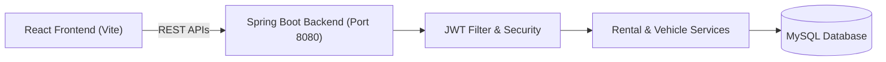
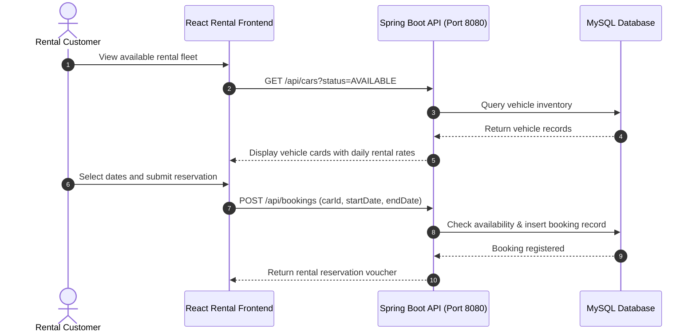

# CarRental Pro — CI/CD Lab Full-Stack Application
[]()
[]()
[]()
[]()

## Overview
A comprehensive full-stack enterprise vehicle rental management system built with Spring Boot (Java 17) backend, Vite + React frontend, and MySQL database. Built as a benchmark application for demonstrating end-to-end continuous integration and continuous deployment (CI/CD) pipelines.

- **Problem Solved:** End-to-end car rental booking, fleet availability management, and automated build verification.
- **Target Users:** Car rental agencies, customers, and DevOps practitioners.
- **Current Status:** Functional Lab Application.

## Features
- **Fleet Management:** Add, update, and inspect rental vehicles and categories.
- **Customer Reservation:** Book vehicles for specified dates with cost estimation.
- **Role-Based Auth:** Admin management panel and Customer booking portal.
- **CI/CD Integration:** Structured build automation for both Java backend and React frontend.

## Architecture


## User Flow


## Technology Stack
| Layer | Technology | Purpose |
|---|---|---|
| Frontend | React 18, Vite, Tailwind CSS | Client booking interface |
| Backend | Java 17, Spring Boot 3 | Vehicle reservation REST API |
| Security | Spring Security, JJWT | User authentication and authorization |
| Database | MySQL 8.0 | Vehicle inventory and booking persistence |

## Infrastructure
- **Frontend Port:** 5173
- **Backend Port:** 8080
- **Database Port:** 3306

## Project Structure
```text
Cicd-lab/
├── backend/
│   ├── src/main/java/com/klu/carrental/
│   │   ├── controller/      # CarController, BookingController, AuthController
│   │   ├── model/           # Vehicle, Booking, User entities
│   │   ├── repository/     # Spring Data JPA repositories
│   │   └── security/       # JwtUtil, SecurityConfig
│   └── pom.xml              # Maven configuration
├── frontend/
│   ├── src/                 # React UI components and pages
│   ├── package.json         # Frontend dependencies
│   └── vite.config.ts       # Vite build configuration
├── .gitignore               # Git ignore definitions
└── README.md                # Technical documentation
```

## Prerequisites
- JDK 17
- Node.js >= 18.x
- Apache Maven >= 3.8
- MySQL Server >= 8.0

## Environment Variables
Backend `application.properties` or environment variables:
```properties
SPRING_DATASOURCE_URL=jdbc:mysql://localhost:3306/carrental_db
SPRING_DATASOURCE_USERNAME=root
SPRING_DATASOURCE_PASSWORD=your_mysql_password
JWT_SECRET=your_secure_256_bit_jwt_secret
```

## Local Development Setup
1. Clone the repository:
   ```bash
   git clone https://github.com/Bhanutejanallamothu/Cicd-lab.git
   cd Cicd-lab
   ```
2. Start Backend:
   ```bash
   cd backend
   ./mvnw spring-boot:run
   ```
3. Start Frontend (in another terminal):
   ```bash
   cd ../frontend
   npm install
   npm run dev
   ```
4. Access application at `http://localhost:5173`.

## Docker Setup
*Not detected in repository. Dockerfiles can be integrated for CI runner automation.*

## Database Setup
Create database in MySQL:
```sql
CREATE DATABASE carrental_db;
```

## API Documentation
- `POST /api/auth/login` - Authenticate customer or admin.
- `GET /api/cars` - List available rental fleet.
- `POST /api/bookings` - Submit reservation for selected car and timeframe.

## Deployment
- Backend deployable as executable JAR to cloud VMs.
- Frontend deployable as static SPA to Vercel/Netlify.

## Security
- Passwords hashed using BCrypt.
- Protected endpoints require Bearer JWT validation.
- SQL injection mitigated through JPA parameterization.

## Testing
Run backend tests:
```bash
cd backend && ./mvnw test
```

## Troubleshooting
- **CORS Blocked:** Verify backend `@CrossOrigin` or CORS configuration includes `http://localhost:5173`.

## Future Improvements
- Automated vehicle return inspection and damage penalty calculation.
- Automated GitHub Actions workflow testing matrix.

## License
Academic / Lab project. All rights reserved by repository owner.
